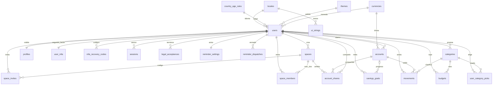

# SIRA

SIRA significa **Sistema de Ingresos, Rentas y Ahorro**. Sirve para anotar ingresos, gastos y ahorro, en solitario o en dúo con otra persona.

La primera entrega es una web que se puede instalar. El proyecto apunta después a una aplicación móvil, con la misma sesión y la misma base, en un servidor propio.

## Base de datos

La gráfica muestra quién se relaciona con quién. No lista columnas ni tipos. Los importes, los conceptos y los datos personales se cifran en la aplicación. La clave no está en ninguna tabla.



Una persona (`users`) tiene un perfil visible, un segundo factor y un aviso. Puede tener varias cuentas, sesiones y movimientos. La meta de ahorro puede existir sin una cuenta. El dúo es un `spaces` de como mucho dos personas. Compartir no abre todas las cuentas: solo las que están en `account_shares`.

| Grupo | Tablas | Para qué |
| --- | --- | --- |
| Catálogos | `locales`, `country_age_rules`, `ui_strings`, `categories`, `themes`, `currencies` | Idiomas, edad mínima del país, textos del interior, categorías, paletas y monedas (sol, dólar, euro y libra). |
| Persona | `users`, `profiles`, `legal_acceptances`, `user_category_picks` | La cuenta, lo que ve la pareja y las categorías que eligió. |
| Acceso | `user_mfa`, `mfa_recovery_codes`, `sessions` | PIN o Authenticator, códigos de un solo uso y la sesión. |
| Dinero | `accounts`, `movements`, `budgets`, `savings_goals` | Corriente, ahorros o efectivo, con día y hora. |
| Dúo | `spaces`, `space_members`, `space_invites`, `account_shares` | Dos personas y las cuentas que una elige enseñar. |
| Aviso | `reminder_settings`, `reminder_dispatches` | La hora del recordatorio y el día en que ya se mostró. |

## Ejecución

Hace falta Node.js 18.18 o posterior, npm y PostgreSQL 18.

```bash
npm install
npm run dev
```

Abre `http://localhost:3000`.

Antes de eso, en PostgreSQL tiene que existir la base `sira`. El SQL no se publica en este repositorio. En el ordenador de desarrollo está en `database/schema.sql` y se aplica una sola vez sobre una base vacía.

La web lee un archivo `.env.local` que tampoco se sube. Ahí van, sin pegarlos en el repositorio:

- `DATABASE_URL`: conexión a la base `sira`
- `AUTH_SECRET`: firma la sesión, con 32 caracteres o más
- `APP_DATA_KEY`: 32 bytes en base64, para cifrar importes y datos personales

Para dejar la web lista para servir:

```bash
npm run build
npm start
```

## Versiones

Las cifras son las del `package.json` de este proyecto.

| Pieza | Versión |
| --- | --- |
| Next.js | 15.5 |
| React | 19.1 |
| TypeScript | 5.9 |
| Tailwind CSS | 3.4 |
| Drizzle ORM | 0.44 |
| node-postgres | 8.16 |
| Zod | 4.1 |
| PostgreSQL | 18 |
| Node.js | 18.18 o posterior |

La interfaz usa Lucide y gráficos con Recharts. La sesión es propia (cookie httpOnly). La contraseña se guarda con bcrypt. El segundo factor es un PIN o Authenticator. La app móvil con Expo sigue sin empezar.
